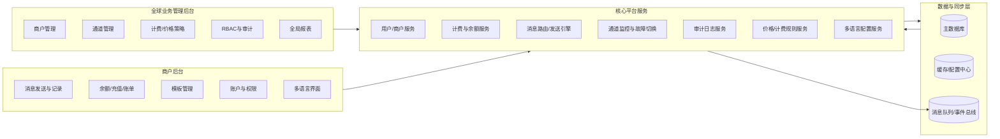

# 全球 SMS/RCS 双后台系统设计

## 系统架构

## 核心功能模块

### 管理后台（中文）
- 商户管理：开户、状态、套餐、价格策略绑定、通道分配。
- 通道管理：SMS/RCS 通道配置、健康监控、权重/优先级调整。
- 计费/价格策略：默认价格表与商户覆盖价格表。
- RBAC 与审计：管理员角色权限控制与敏感操作审计。
- 全局报表：消息量、失败率、通道表现、收入趋势。

### 商户后台（多语言）
- 消息发送/记录：批量发送、API 发送、状态回执。
- 余额管理：充值、扣款、账单、余额实时查询。
- 模板管理：短信与 RCS 模板审核。
- 账户与权限：主账号与子账号权限。
- 智能语言切换：IP 自动识别 + 手动切换。

## 多语言支持
- 自动切换：基于 IP 和 Geo 信息。
- 手动切换：用户可随时切换为中文、英语、西班牙语、葡萄牙语。
- 语言优先级：手动设置 > IP 自动识别。

## 计费与余额逻辑
- 按条计费：SMS/RCS 每条定价。
- 字符长度检测：根据国家/地区短信长度标准拆分计费。
- 余额管理：充值、扣款、冻结与释放。
- 商户独立价格：商户价格可覆盖全局默认价格。

## 通道管理
- 通道配置：服务商、覆盖国家、单价、SLA。
- 商户通道分配：不同商户绑定不同通道池。
- 性能监控：成功率、延迟、错误码统计。
- 故障切换：异常触发自动切换。
- 手动策略：管理员调整优先级与分配策略。

## 安全与权限
- RBAC：管理员与商户权限严格分离。
- 商户隔离：仅可访问自身数据。
- 审计日志：敏感操作记录。

## 数据库表结构设计（字段级）

### merchants
| 字段 | 类型 | 说明 |
| --- | --- | --- |
| id | bigint | 主键 |
| name | varchar(128) | 商户名称 |
| status | varchar(16) | active/suspended |
| timezone | varchar(32) | 时区 |
| country_code | varchar(8) | 国家/地区 |
| default_language | varchar(8) | 默认语言 |
| created_at | datetime | 创建时间 |
| updated_at | datetime | 更新时间 |

### merchant_users
| 字段 | 类型 | 说明 |
| --- | --- | --- |
| id | bigint | 主键 |
| merchant_id | bigint | 商户 ID |
| email | varchar(128) | 登录邮箱 |
| password_hash | varchar(256) | 密码哈希 |
| status | varchar(16) | active/disabled |
| last_login_ip | varchar(64) | 登录 IP |
| preferred_language | varchar(8) | 手动语言偏好 |
| created_at | datetime | 创建时间 |
| updated_at | datetime | 更新时间 |

### admin_users
| 字段 | 类型 | 说明 |
| --- | --- | --- |
| id | bigint | 主键 |
| username | varchar(64) | 账号 |
| password_hash | varchar(256) | 密码哈希 |
| status | varchar(16) | active/disabled |
| created_at | datetime | 创建时间 |
| updated_at | datetime | 更新时间 |

### roles
| 字段 | 类型 | 说明 |
| --- | --- | --- |
| id | bigint | 主键 |
| scope | varchar(16) | admin/merchant |
| name | varchar(64) | 角色名称 |
| created_at | datetime | 创建时间 |

### permissions
| 字段 | 类型 | 说明 |
| --- | --- | --- |
| id | bigint | 主键 |
| code | varchar(64) | 权限编码 |
| name | varchar(128) | 权限说明 |

### role_permissions
| 字段 | 类型 | 说明 |
| --- | --- | --- |
| role_id | bigint | 角色 ID |
| permission_id | bigint | 权限 ID |

### user_roles
| 字段 | 类型 | 说明 |
| --- | --- | --- |
| user_id | bigint | 用户 ID |
| role_id | bigint | 角色 ID |
| scope | varchar(16) | admin/merchant |

### wallets
| 字段 | 类型 | 说明 |
| --- | --- | --- |
| id | bigint | 主键 |
| merchant_id | bigint | 商户 ID |
| balance | decimal(18,6) | 可用余额 |
| frozen_balance | decimal(18,6) | 冻结余额 |
| currency | varchar(8) | 货币 |
| updated_at | datetime | 更新时间 |

### wallet_transactions
| 字段 | 类型 | 说明 |
| --- | --- | --- |
| id | bigint | 主键 |
| merchant_id | bigint | 商户 ID |
| type | varchar(16) | recharge/debit/refund |
| amount | decimal(18,6) | 金额 |
| balance_after | decimal(18,6) | 交易后余额 |
| reference | varchar(64) | 关联任务/订单 |
| created_at | datetime | 创建时间 |

### pricing_default
| 字段 | 类型 | 说明 |
| --- | --- | --- |
| id | bigint | 主键 |
| country_code | varchar(8) | 国家/地区 |
| channel_type | varchar(16) | SMS/RCS |
| unit_price | decimal(18,6) | 单价 |
| segment_length | int | 单条长度 |
| created_at | datetime | 创建时间 |

### pricing_overrides
| 字段 | 类型 | 说明 |
| --- | --- | --- |
| id | bigint | 主键 |
| merchant_id | bigint | 商户 ID |
| country_code | varchar(8) | 国家/地区 |
| channel_type | varchar(16) | SMS/RCS |
| unit_price | decimal(18,6) | 单价 |
| segment_length | int | 单条长度 |
| created_at | datetime | 创建时间 |

### channels
| 字段 | 类型 | 说明 |
| --- | --- | --- |
| id | bigint | 主键 |
| provider_name | varchar(128) | 服务商 |
| channel_type | varchar(16) | SMS/RCS |
| status | varchar(16) | active/down |
| priority | int | 优先级 |
| sla | varchar(64) | SLA |
| created_at | datetime | 创建时间 |

### merchant_channel_bindings
| 字段 | 类型 | 说明 |
| --- | --- | --- |
| id | bigint | 主键 |
| merchant_id | bigint | 商户 ID |
| channel_id | bigint | 通道 ID |
| weight | int | 权重 |
| created_at | datetime | 创建时间 |

### channel_routes
| 字段 | 类型 | 说明 |
| --- | --- | --- |
| id | bigint | 主键 |
| merchant_id | bigint | 商户 ID |
| country_code | varchar(8) | 国家/地区 |
| channel_type | varchar(16) | SMS/RCS |
| strategy | varchar(32) | priority/weight/failover |
| created_at | datetime | 创建时间 |

### message_templates
| 字段 | 类型 | 说明 |
| --- | --- | --- |
| id | bigint | 主键 |
| merchant_id | bigint | 商户 ID |
| name | varchar(128) | 模板名称 |
| content | text | 模板内容 |
| status | varchar(16) | pending/approved/rejected |
| created_at | datetime | 创建时间 |

### message_tasks
| 字段 | 类型 | 说明 |
| --- | --- | --- |
| id | bigint | 主键 |
| merchant_id | bigint | 商户 ID |
| channel_type | varchar(16) | SMS/RCS |
| total_recipients | int | 目标数量 |
| segments | int | 拆分条数 |
| total_cost | decimal(18,6) | 总费用 |
| status | varchar(16) | queued/sending/done |
| created_at | datetime | 创建时间 |

### message_records
| 字段 | 类型 | 说明 |
| --- | --- | --- |
| id | bigint | 主键 |
| task_id | bigint | 任务 ID |
| recipient | varchar(64) | 号码 |
| country_code | varchar(8) | 国家/地区 |
| channel_id | bigint | 通道 ID |
| status | varchar(16) | delivered/failed/pending |
| error_code | varchar(32) | 错误码 |
| created_at | datetime | 创建时间 |

### audit_logs
| 字段 | 类型 | 说明 |
| --- | --- | --- |
| id | bigint | 主键 |
| actor_id | bigint | 操作人 |
| actor_scope | varchar(16) | admin/merchant |
| action | varchar(128) | 操作 |
| target | varchar(128) | 目标 |
| ip | varchar(64) | 操作 IP |
| created_at | datetime | 创建时间 |

## API 接口定义（示例）

### 管理后台
- `POST /api/admin/login` 管理员登录
- `GET /api/admin/merchants` 商户列表
- `POST /api/admin/merchants` 新建商户
- `PATCH /api/admin/merchants/{id}` 更新商户
- `GET /api/admin/channels` 通道列表
- `POST /api/admin/channels` 新建通道
- `PATCH /api/admin/channels/{id}` 更新通道
- `POST /api/admin/channels/{id}/switch` 手动切换通道
- `GET /api/admin/pricing/default` 默认价格表
- `PATCH /api/admin/pricing/override/{merchantId}` 商户价格覆盖
- `GET /api/admin/audit-logs` 审计日志

### 商户后台
- `POST /api/merchant/login` 商户登录
- `GET /api/merchant/profile` 商户信息
- `GET /api/merchant/balance` 余额查询
- `POST /api/merchant/recharge` 充值
- `GET /api/merchant/messages/tasks` 发送任务列表
- `POST /api/merchant/messages/tasks` 创建发送任务
- `GET /api/merchant/messages/records` 发送记录查询
- `GET /api/merchant/templates` 模板列表
- `POST /api/merchant/templates` 新建模板
- `PATCH /api/merchant/templates/{id}` 更新模板
- `GET /api/merchant/languages` 获取支持语言

## 关键业务流程

### 消息发送
1. 商户创建任务并校验余额。
2. 进行字符长度检测，计算拆分条数。
3. 计算费用并冻结余额。
4. 路由选择通道发送。
5. 更新投递状态并扣款完成。

### 通道故障切换
1. 监控成功率/延迟异常。
2. 自动切换备用通道。
3. 记录审计日志并告警。

### 计费结算
1. 按国家/地区规则计算条数。
2. 使用商户覆盖价格或默认价格。
3. 生成扣款流水。

## 测试用例与监控方案

### 测试用例
- 余额不足时发送失败并回滚冻结。
- 字符长度跨国差异导致拆分条数正确。
- 商户价格覆盖生效。
- 通道故障触发自动切换。
- RBAC 校验：商户不可访问他人数据。

### 监控指标
- 通道成功率、延迟、错误码分布。
- 每分钟发送量与失败率。
- 余额异常波动。
- 通道切换次数与原因。
- 审计日志告警频率。
